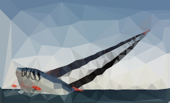
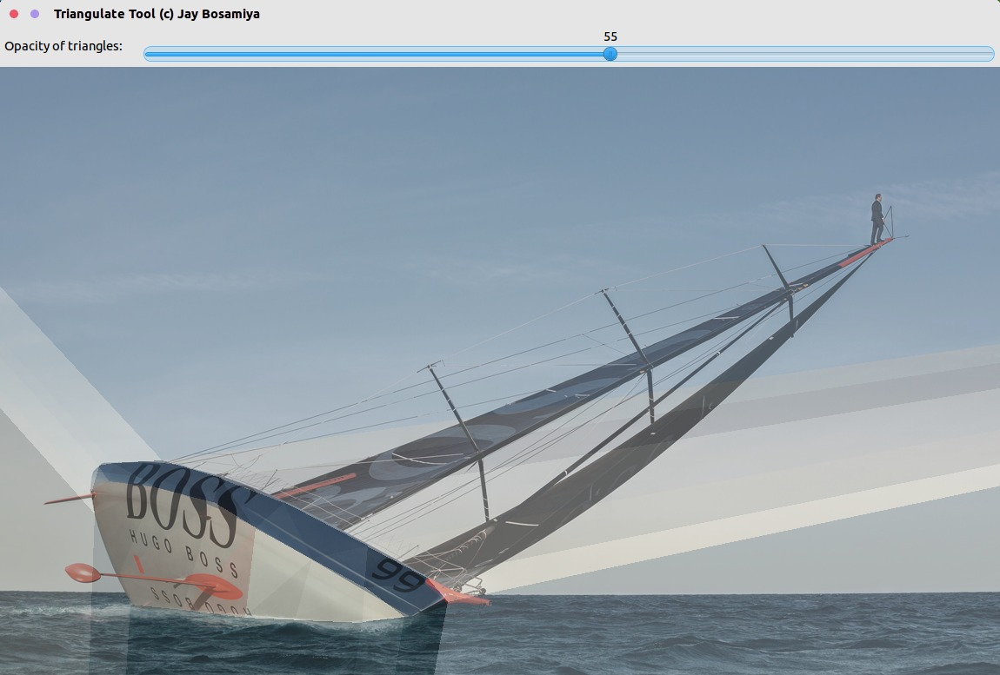
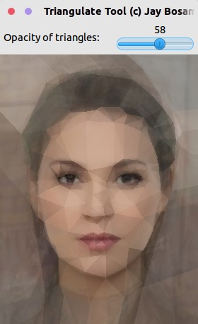

Triangulate Tool
================

> Easily convert any image into low-poly art in just a few clicks

Convert  to 

Screenshots
-----------





How it works
------------

The tool takes in every point that you click and runs a [Delaunay Triangulation](https://en.wikipedia.org/wiki/Delaunay_triangulation) on it. It then averages out the colours in the source image for each triangle in order to generate the low-poly image.

Usage
-----

```bash
./triangulate-tool input_image output_image
```

Build process
-------------

```bash
mkdir build
cd build
cmake ..
make
```

Requirements
------------

+ OpenCV 2.x
+ CMake 2.8 or above

License
-------

This software is licensed under the [MIT License](http://jay.mit-license.org/2015)
